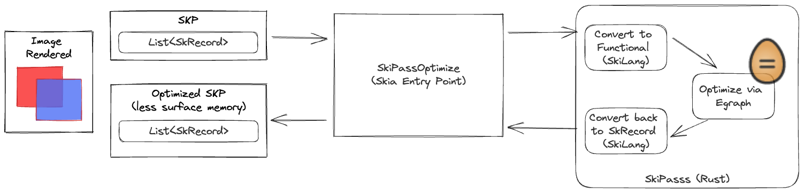
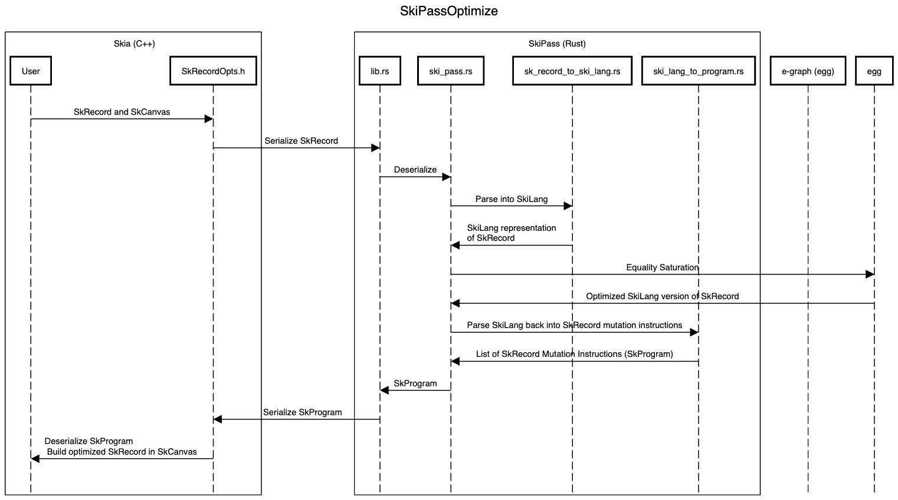
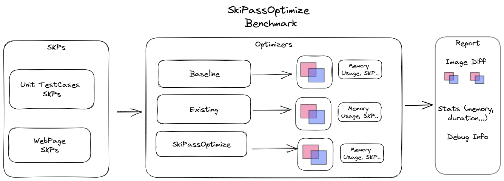

# SkiPass (Optimizing Skia with Egraphs)

SkiPass attempts to optimize [Skia](https://skia.org) SkPictures using Egraphs (via [egg](https://egraphs-good.github.io/)).

## QuickStart

```bash
make local-nightly # Generates report in ./skia_opt_research/out
```


## SkiPass Details 

### High Level Overview



In Skia, a [SkPicture](https://api.skia.org/classSkPicture.html) or SKP, is a recording of draw commands (internally called [SkRecords](https://source.chromium.org/chromium/chromium/src/+/main:third_party/skia/src/core/SkRecords.h?q=SkRecords&ss=chromium)).

SkiPass converts a sequential list of draw commands in a SKP to a functional representation, which we call SkiLang of the final image rendered by the SKP. This functional representation is optimized using [egg](https://github.com/egraphs-good/egg), a e-graph library using a collection of simple equivalence functional rules. 


### SkiLang and Rewrite rules

SkiLang is a functional representation of SkRecord Draw Commands. 

#### SkiLang operators that directly translate to the Skia API

|SkiLang Operator| Skia Translation |
|----------------|-------------|
|(drawCommand ...)  | Corresponds to all draw commands not listed below. |
|(concat surface1 surface2) | Concatenate the instructions of surface2 with surface1 |
|(concat44 ...)   |  Translates to `concat44()` |
|(clipRect ...) | Translates to a `clipRect` Skia. | 
|(matrixOp ...) |  Translates to stateOps that SkiLang does not support (`clipRRect`, `clipPath`) |
|(merge dst src mergeParams) | Translates to a `saveLayer(bounds, paint)` call in Skia. 

#### SkiLang Virtual Ops

Virtual Ops are SkiLang operators that don't have a direct SkiLang translation, but are useful for rewrite rules.


|SkiLang Operator | Description |
|-----------------|-------------|
|(srcOver dst src)| Merge src onto dst using [srcOver](https://api.skia.org/SkBlendMode_8h.html#ad96d76accb8ff5f3eafa29b91f7a25f0aaf4170d00ece11896f697ccda0745dff) blend mode   |
|(apply_alpha surface alpha)| Apply an opacity of alpha onto surface |

A few virtual ops that are used internally not listed above. These exist mainly because we do not support the entirety of Skia's API.

For more examples on SkiLang to Skia translation [check here](SkiLang.md).

### SkiPass optimize path



The SkiPass optimize path involves the following steps

1. Extract all the draw calls and parameters that SkiLang understands and pack into a protobuf.
2. SkiPass deserializes the proto and constructs a SkiLang expression, a functional representation of the image created by the draw calls.
3. Feed the expression into a e-graph and run equality saturation with rewrite rules and find a more optimal version (in terms of layers created) 
4. Extracting the optimized program and pass it back to the C++

### [SkRecordOpts: SkiPassOptimize](src/core/SkRecordOpts.h)
The SkiPass optimize method is added to [SkRecordOpts.h](src/core/SkRecordOpts.h). 

[SkiPassOptimize](src/core/SkRecordOpts.h) takes in a [SkRecord](src/core/SkRecord.h) and returns a [SkCanvas](include/core/SkCanvas.h) representing the optimized [SkRecord](src/core/SkRecord.h). 

The reason a SkCanvas is returned instead of a new SkRecord or modifying the original SkRecord in place is that SkCanvas provides a convenient API to create a new SkRecord.

### [SkiPass Protos](skia_opt_research/protos/ski_pass.proto)
SkiPass uses protobufs to facilitate interop between Rust and C++. The [protobuf definitions](skia_opt_research/protos/ski_pass.proto) capture the subset of [SkRecords.h](src/core/SkRecords.h) that are relevant to SkiLang.

### [SkiPass](skia_opt_research/SkiPass/)

The SkiPass code is responsible for

1. [Constructing a SkiLang expression](skia_opt_reserach/SkiPass/src/sk_record_to_ski_lang.rs) from a SkRecord. 
2. Running Equality Saturation via egg using [rewrite rules](skia_opt_research/SkiPass/ski_lang_rules.rs).

3. [Constructing instructions](skia_opt_research/SkiPass/src/ski_lang_to_program.rs) which SkRecordOpts can use to construct the optimized SkRecord.


## Benchmark Details



### Benchmark Report

Running the benchmark using `make local-nightly` generates a report in `./skia_opt_research/out`. 

The report contains a image diff reports, memory usage, basic performance profiling and debug links.

Here is a sample [Benchmark Report](http://nightly.cs.washington.edu/reports/skia/1683325742/)

### Measuring Memory
Memory is measured by adding an integer counter to [SkMalloc](include/private/SkMalloc.h#L146). This is reset per benchmark SKP in [SkpAnalyzer](./skia_opt_research/skp_analyzer.h).

Reallocations (Free and reuse the same allocated bytes) are counted as a new allocation. 

### TestCases

* [Unit Test Cases](./skia_opt_research/gen_skp.cpp)
* [WebPage SKPs](./skia_opt_research/webpage_skps/)

Use [SkFiddle](https://fiddle.skia.org) as a way to quickly prototype new unit test cases.

To extract a new WebPage SKP, use this [script](./gen_webpage_skps.py). 

### Debugging Tips

Links to SKP files are present in the report. Open these up in [Skia Debugger](https://debugger.skia.org) for more information.

-------------
(Below follows the original Skia README)

--------

Skia is a complete 2D graphic library for drawing Text, Geometries, and Images.

See full details, and build instructions, at https://skia.org.
